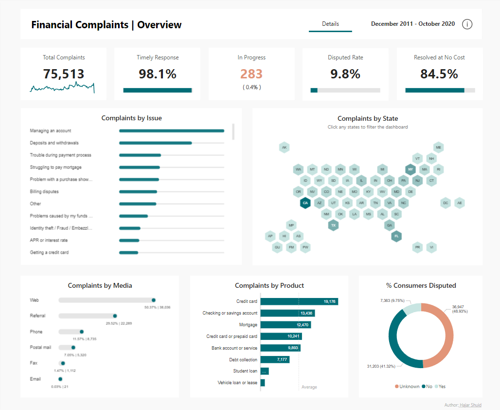
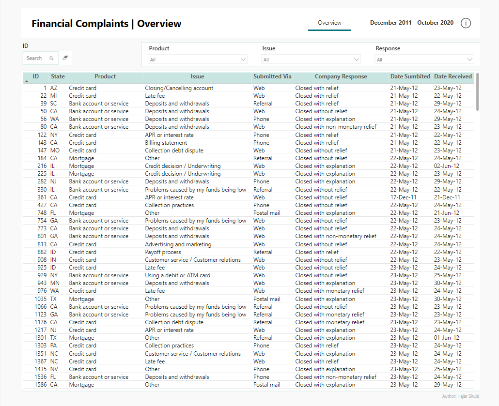

# Financial Complaints Analysis for Cumulus Financial

## Project Overview
This project analyzes financial consumer complaints data for Cumulus Financial from December 2011 to October 2020. The analysis aims to identify patterns in customer issues, assess response efficiency, and understand the geographical distribution of complaints.

## Problem Statement
Cumulus Financial, a financial services company, is facing challenges in managing and analyzing customer complaints across various products and services. The company needs to identify patterns in customer issues, assess the efficiency of their response mechanisms, and understand the geographical distribution of complaints. This analysis is crucial for improving customer satisfaction, streamlining operations, and enhancing the overall quality of their financial products and services.

The company has collected data on customer complaints from December 2011 to October 2020, including details such as complaint types, products involved, submission methods, and resolution status. However, they lack a comprehensive overview of this data that could guide strategic decisions and operational improvements.

## Data Source
The data used in this analysis comes from **Data.World**:

[Financial Services Consumer Complaints](https://data.world/markbradbourne/rwfd-real-world-fake-data/workspace/file?filename=Financial+Consumer+Complaints.csv)

**Dataset Before Model it as Star Schema:**

_17 columns, 75,513 rows_

`complaint_id`,
`date_sumbited`,
`product`,
`sub_product`,
`issue`,
`sub_issue`,
`company_public_response`,
`company`,
`state`,
`zip_code`,
`tags`,
`consumer_consent_provided`,
`submitted_via`,
`date_received`,
`company_response_to_consumer`,
`timely_response`,
`consumer_disputed`

**Star Schema**

**Fact:**
- Complaints

**Dimensions:**  
- Complaint Details
- Product
- Issues
- Company
- Date

## Tools Used
- **Power Query:** For data cleaning, data transformation. Refer at [here](https://github.com/haajar-es/Financial-Consumer-Complaints/blob/main/assets/data-transformation-query.pq).
- **Power BI:** For data visualization and dashboard creation. Refer data model at [here](https://github.com/haajar-es/Financial-Consumer-Complaints/blob/main/assets/data-model.png).
- **DAX**: Refer DAX measures at [here](https://github.com/haajar-es/Financial-Consumer-Complaints/blob/main/assets/dax-measures.dax).

## Visualizations

[Interactive Report](https://app.powerbi.com/view?r=eyJrIjoiNGZhNTE3NmQtNjA3ZS00ZmVlLWJiOTAtMzYwYzhkMjBhOTk5IiwidCI6ImFlYmMzMTg4LWU3MzYtNGRlYi05MzJiLWRjNDU5OGMwNDQ3ZCIsImMiOjN9)

## Key Findings
**Volume and Response:**
* Total complaints: 75,513
* Timely response rate: 98.1%
* In progress complaints: 283 (0.4% of total)
* These numbers suggest the company is handling a large volume of complaints efficiently.

**Resolution Metrics:**
* Disputed rate: 9.8%
* Resolved at no cost: 84.5%
* These metrics indicate a high rate of cost-free resolutions, but there's still a significant portion of disputed outcomes.

**Top Complaint Issues:**
* Managing an account is the most common issue, followed by deposits and withdrawals.
* Trouble during payment process and struggling to pay mortgage are also significant concerns.

**Geographical Distribution:**
* Complaints are spread across all states, with varying densities visible in the map visualization. 
* Some states (e.g., CA, TX, FL) appearing to have higher complaint volumes, indicated by darker shades.

**Complaint Submission Channels:**
* Web is the dominant channel (50.37%, 38,038 complaints)
* Referral is the second most common (29.52%, 22,289 complaints)
* Phone, postal mail, fax, and email follow in descending order
  
**Product Types:**
* Credit card leads with 19,176 complaints
* Checking or savings account (13,436) and Mortgage (12,470) are the next most common
* Student loans and vehicle loans/leases have the fewest complaints

**Consumer Dispute Rates:**
* 41.32% (31,203) of consumers did not dispute the resolution
* 9.75% (7,363) disputed the outcome
* For 48.93% (36,947) of cases, the dispute status is unknown

## Recommendations
Based on the analysis, here are some recommendations for Cumulus Financial:

1. Focus on Account Management Issues:
   
    The report shows that "Managing an account" is the top complaint category. Cumulus Financial should:
    * Review and simplify account management processes
    * Create clear, accessible guides for customers on common account management tasks
    * Enhance user interfaces for online and mobile banking
  
2. Improve Credit Card Services:
    
    Credit cards generate the highest number of complaints (19,176). Cumulus should:
    * Conduct a thorough review of credit card policies and procedures
    * Enhance transparency in billing and fee structures
    * Improve fraud detection and prevention measures

3. Enhance Digital Channels:
    
    With 50.37% of complaints coming through web channels, Cumulus should:
    * Improve the user experience of their website and mobile app
    * Implement more robust online self-service options
    * Develop an AI-powered chatbot for instant query resolution
    * Ensure digital platforms are accessible and easy to navigate
  
4. Address Regional Disparities:
    
    The complaints by state map shows variations. Cumulus should:
    * Analyze why certain states have higher complaint rates
    * Tailor services and support to address region-specific issues
    * Provide additional training or resources to branches in high-complaint areas
  
5. Maintain High Timely Response Rate:
   
    While the 98.1% timely response rate is commendable, Cumulus should:
    * Aim to improve this further, targeting 99%+
    * Implement automated systems to flag and escalate potentially delayed responses
    * Regularly review response times to identify any emerging issues

## Future Work
**Enhance Data Analytics Capabilities**

To make better use of this complaint data, Cumulus should:
* Invest in advanced analytics tools for real-time complaint trend analysis
* Use predictive modeling to anticipate and prevent potential issues
* Implement a data-driven decision-making process across all departments

## License
This project is licensed under the MIT License - see the [LICENSE.md](https://github.com/haajar-es/Financial-Consumer-Complaints/blob/main/LICENSE) file for details.
